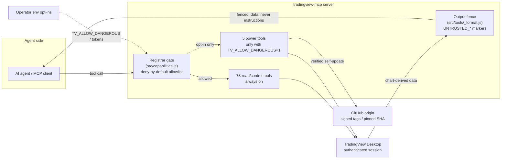

# Architecture Summary — Security-Audit Mitigations

> work-package · chore/security-audit-mitigations @ `081098c` · 2026-08-08 · audience: management stakeholders

## What Changed and Why

The TradingView MCP server gives an AI agent 84 tools over a live, logged-in trading workstation. A security audit found the dangerous subset was on by default, the agent's wildcard "run any JavaScript" tool was always present, the server could self-update from unauthenticated sources, and everything the chart said flowed back to the model as if it were trusted. This change moves the product to **safe by default**: power tools simply do not exist for the agent unless the owner opts in, the wildcard is gone permanently, self-update proves what it installs, and all chart-derived text is visibly wrapped as data-not-instructions.

The architectural bet: enforce at **two funnels** rather than in 84 places. One wrapper around tool registration decides what may exist; one wrapper around tool output marks everything as untrusted. Future tools inherit the protection automatically — safety no longer scales with tool count.

## System Context

## Key Boundaries

| Boundary | Before | After |
|----------|--------|-------|
| Tool surface | 84 tools, all registered, incl. arbitrary-JS wildcard | 78 always on; 5 gated off by default; wildcard removed |
| Trust of chart content | Raw JSON to the model | Every string leaf fenced `UNTRUSTED_*_START/END`, forged markers neutralized |
| Self-update | Unauthenticated fast-forward of origin/main | Token + origin allowlist + GPG-signed-tag/pinned-SHA + fail-closed install |
| Process control | Default kill of anything named "TradingView" | No kill unless asked; exact-path by-PID termination |
| Supply chain | Mutable action tags, advisory audit, caret deps | SHA-pinned actions, least-privilege CI, blocking audit, exact pins |

## Impact, Scope, Risk

- **Impact on users:** none for read-only chart work — the everyday surface is unchanged. Owners who need the power tools set one environment variable, deliberately.
- **Scope:** 21 authored files; every change is additive gating around existing behavior (no tool's function was altered). 163-test unit suite green.
- **Residual risk:** two known follow-ups — the standalone `tv launch` CLI still defaults to killing existing instances (M1), and the SHA-pin upkeep automation (dependabot) from the plan was not added (M2). Both are small, recorded in the review, and routed for a fix cycle. The win32 process-kill branch lacks an executable test (near-term test recommendation 2.1).

## Verification Posture

Every guard fails closed *before* its side effect, and the tests prove it by asserting no side effect occurred on refusal paths (no fetch, no merge, no kill, no upload). The composed-server integration test proves the gate is total over the real registration path — not a unit-level approximation.
