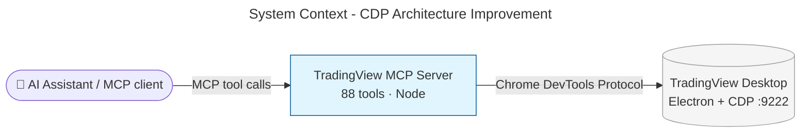
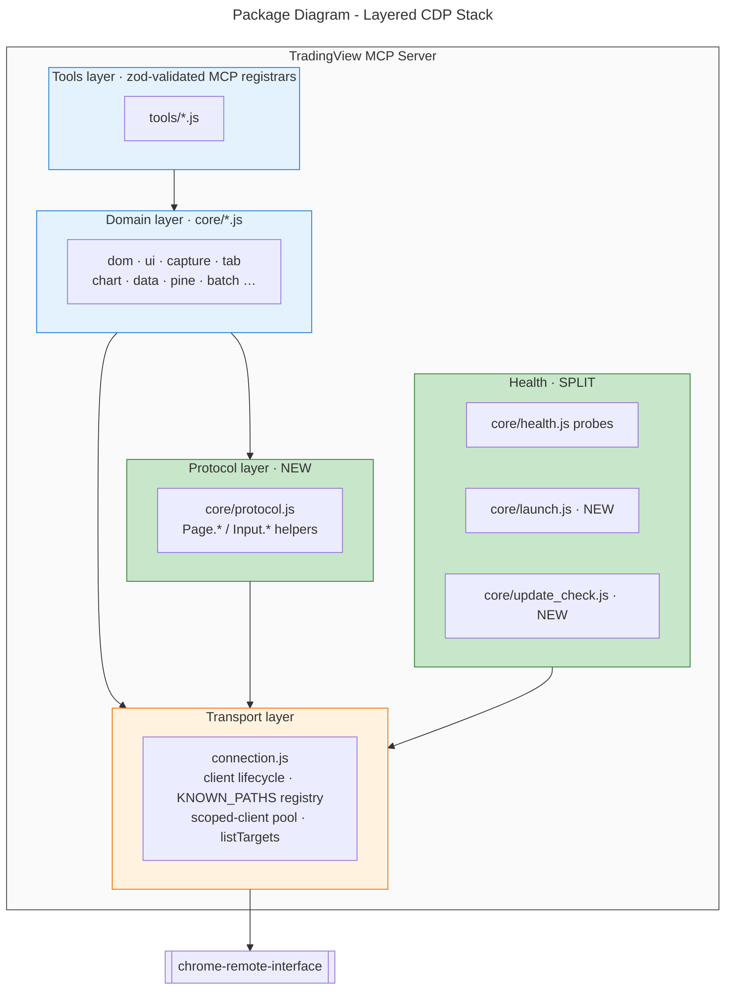
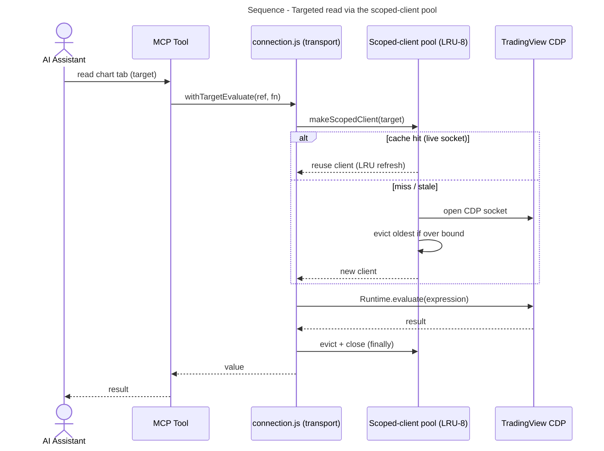
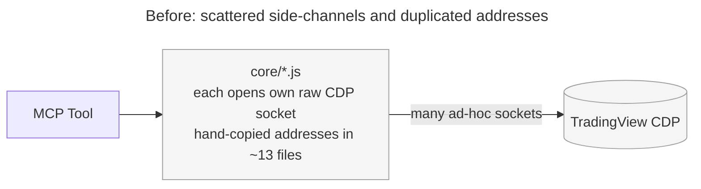
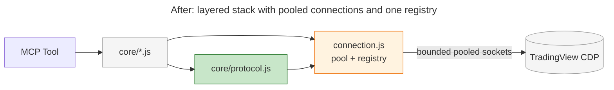

# Architecture Summary

> architecture-summary · Improve CDP Architecture of TradingView MCP Server · #24 Improve CDP architecture · 2026-08-15 · post-implementation review

## Executive Summary

The TradingView MCP server drives a live TradingView Desktop chart through one private channel (the Chrome DevTools Protocol). Over time that channel sprouted ad-hoc side-connections, hand-copied internal addresses in about a dozen files, scattered low-level remote-control calls, and one over-crowded file mixing unrelated jobs. This work restores the channel's intended layered structure — one registry for internal addresses, one managed point that hands out short-lived connections safely, one module for low-level protocol calls, shared wait helpers, and a split of the over-crowded file — so the 88 tools stay dependable and cheap to extend, and working several chart tabs at once no longer wedges the connection.

## System Context

The server is a Node MCP bridge: an AI assistant calls its tools, the tools drive TradingView Desktop (an Electron app) over CDP on `127.0.0.1:9222`, and TradingView Desktop renders the user's charts.

## Package Structure

The change reinforces a one-directional, acyclic layered stack and adds two new modules (highlighted). Domain modules no longer open their own raw connections or issue raw protocol calls; both are confined to the transport and protocol layers.

## Key Flows

The central change is how a tool reads a background chart tab. Before, each such read opened a raw CDP socket and closed it ad hoc; concurrent sockets wedged TradingView's endpoint. Now a bounded LRU pool hands out and reuses short-lived connections.

## What Changed

### Components Added/Modified

| Component | Change Type | Description |
|-----------|-------------|-------------|
| `connection.js` scoped-client pool | Added | Bounded LRU-8 pool handing out short-lived per-tab CDP connections; the multi-tab wedge fix |
| `connection.js` `listTargets()` | Added | Single transport-owned read of the CDP `/json/list` endpoint |
| `core/protocol.js` | Added | Single home for raw `Page.*`/`Input.*` CDP domain calls |
| `core/launch.js` | Added | TradingView Desktop launch logic, extracted from health.js |
| `core/update_check.js` | Added | Best-effort update check, extracted from health.js |
| `core/health.js` | Modified | Reduced to health/discovery probes; launch and update-check re-exported |
| `KNOWN_PATHS` registry adoption | Modified | ~13 files now read internal addresses from one registry |
| `wait.js` `sleep` | Modified | Shared delay helper replacing scattered local one-liners |

### Key Changes

- **One registry for internal addresses:** a TradingView internals change is now a one-line edit instead of a hunt through ~13 files.
- **One managed connection point:** short-lived per-tab connections are pooled and reused within a bound, removing the connection wedges seen on 2026-08-14.
- **One protocol module:** low-level remote-control calls live in a single greppable place with one edit site for future protocol changes.
- **Shared wait helpers and a split health module:** stray fixed delays use one canonical helper, and the over-crowded health file is split into three focused modules.

## Before & After

### Before

### After

## Impact

### Who Is Affected

| Stakeholder | Impact | Notes |
|-------------|--------|-------|
| Users of the 88 tools | Medium | No behaviour change; multi-tab work no longer wedges the connection |
| Maintainers | High | Internal-address changes are one-line edits; new manager surfaces are a registry entry plus a factory call |
| Operators | Low | Pool size tunable via `TV_CDP_POOL_SIZE`; loopback-CDP security invariant retained |

## Risks & Mitigations

| Risk | Likelihood | Impact | Mitigation |
|------|------------|--------|------------|
| Pool eviction/liveness regression reintroduces the wedge | Low | Medium | Pool state transitions lack a direct unit test (flagged in review); add `tests/scoped_pool.test.js` before relying on the bound |

## Future Considerations

Push-notification and new-tool directions (market-mover lists, richer backtesting, account operations, alert notifications) are deliberately out of scope and recorded as follow-ups on this cleaned base.

## Related Documents

- [Work package plan](06-work-package-plan.md)
- [Design philosophy](02-design-philosophy.md)
- [Code review report](10-code-review.md) · [Test suite review](10-test-suite-review.md)
