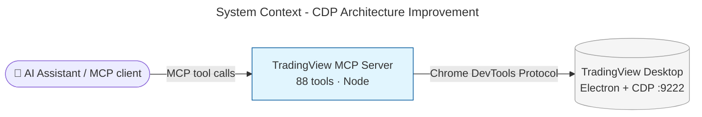

# Architecture Summary

> architecture-summary · Improve CDP Architecture of TradingView MCP Server · #24 Improve CDP architecture · 2026-08-16 · strategic review

The stakeholder architecture home for this work package is the [post-implementation summary](10-architecture-summary.md). This pass removed leftover surface only (empty keep-file, unused borrow helper) and did not change the layered stack.

## Executive Summary

The server still talks to TradingView Desktop through one managed channel: one registry for internal addresses, one connection pool for short-lived clients, one module for low-level remote-control calls, shared wait helpers, and a split health surface. The 88 tools and the command-line stay the same to callers. Parallel tab work no longer opens competing private sockets.

## System Context

Package, sequence, and before/after diagrams live in the [post-implementation summary](10-architecture-summary.md).

## What Changed

### Components Added/Modified

| Component | Change Type | Description |
|-----------|-------------|-------------|
| Transport | Modified | Shared registry, target listing, and an LRU connection pool replace private sockets |
| Protocol | Added | One module owns low-level page and input calls |
| Health | Modified | Probes stay; launch and update-check moved out |

### Key Changes

- **One channel:** tools share a managed connection instead of opening their own.
- **One address book:** TradingView internal moves become a single edit.
- **Same behaviour:** the 88-tool surface and CLI stay behaviour-identical.

## Impact

### Who Is Affected

| Stakeholder | Impact | Notes |
|-------------|--------|-------|
| Agent operator | Medium | Parallel tab reads should no longer wedge the channel |
| Maintainer | High | Internal-address updates and new manager surfaces get cheaper |
| End user of the 88 tools | Low | No intended behaviour change |

## Related Documents

- [Work package plan](06-work-package-plan.md)
- [Post-implementation architecture summary](10-architecture-summary.md)
- [Strategic review](12-strategic-review-1.md)
