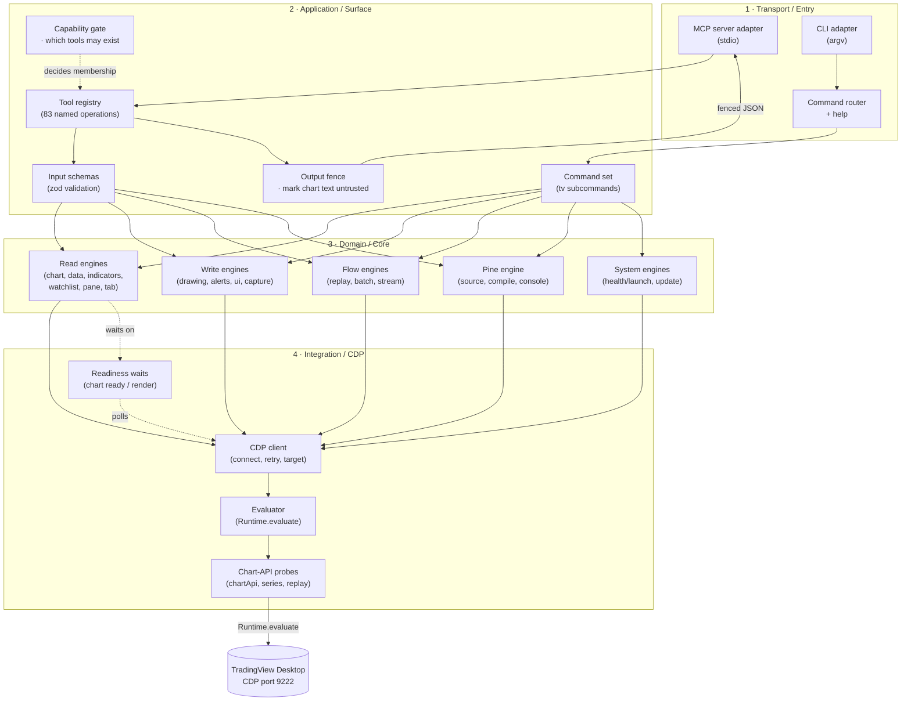
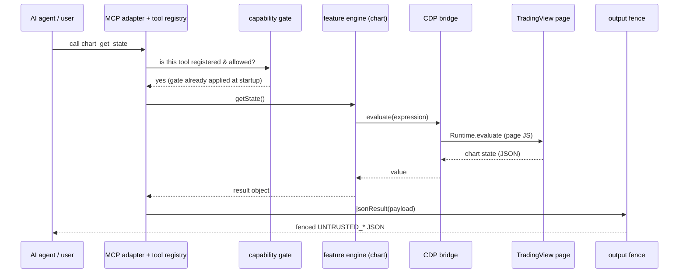
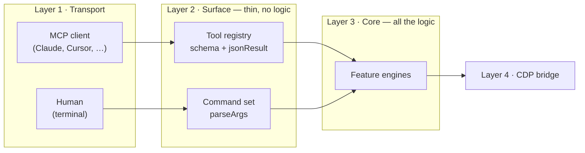
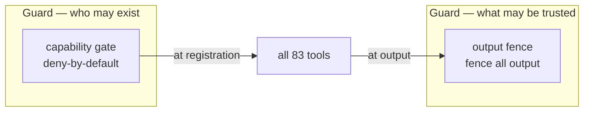

# Architecture — TradingView MCP

> whole-project design · 2026-08-08 · audience: engineers and stakeholders
> Sibling to [10-architecture-summary.md](10-architecture-summary.md), which covers the security-mitigation change specifically. This document covers the whole system.

## Overview

TradingView MCP lets an AI agent read and drive a live, logged-in TradingView Desktop chart. It does this by attaching to the app's Chrome DevTools Protocol (CDP) debugging port, evaluating small pieces of JavaScript inside the chart page, and exposing the results as a set of well-defined tools. The same engine is reachable two ways: as an **MCP server** that an AI client talks to over stdio, and as a **`tv` command-line tool** a human runs in a terminal. Everything an agent or a user can do funnels through one small set of core modules — there is no back door around them.

## The Layers

The project is organized as four layers. Each layer only talks to the one directly below it, and only the bottom layer ever touches the chart. Within a layer we group code by **logical component** — what job it does — rather than by file. A component sits in the layer whose concern it serves, even if it lives in a differently-named file.

| Layer | Logical components | Responsibility | Talks to |
|-------|--------------------|----------------|----------|
| **1 · Transport / Entry** | MCP server adapter · CLI adapter · Command router | Get a request in from the outside world — MCP over stdio, or argv (the router maps argv to a command and prints help) | Layer 2 |
| **2 · Application / Surface** | Tool registry · Command set · Input schemas · **Capability gate** · **Output fence** | Define the named operations, validate inputs (schemas), shape outputs — and guard the two funnels everything passes through (gate at registration, fence at response) | Layer 3 |
| **3 · Domain / Core** | Read engines · Write engines · Flow engines · Pine engine · System engines | The actual chart logic, grouped by kind of work (below) | Layer 4 |
| **4 · Integration / CDP** | CDP client · Evaluator · Chart-API probes · Readiness waits | The only place that speaks CDP: hold the connection, evaluate page JS, reach TradingView's internal APIs, wait for the chart to settle | TradingView |

The core groups, by kind of work:

- **Read engines** (`chart`, `data`, `indicators`, `watchlist`, `pane`, `tab`) — read chart state and return it. No side effects.
- **Write engines** (`drawing`, `alerts`, `ui`, `capture`) — change what is on the chart or capture it.
- **Flow engines** (`replay`, `batch`, `stream`) — multi-step or multi-symbol sequences.
- **Pine engine** (`pine`) — the Pine Script editor: source, compile, errors, console.
- **System engines** (`health`, `update`) — the process and the server itself: launch, health check, self-update.

The Integration layer splits into four jobs, all in `src/connection.js` plus `src/wait.js`:

- **CDP client** — connect, retry with backoff, find and follow the chart target. (`connection.js`)
- **Evaluator** — the single `evaluate()` every chart read/write ends as. (`connection.js`)
- **Chart-API probes** — reach TradingView's internal chart/series/replay APIs. (`connection.js`)
- **Readiness waits** — block until the chart has data and has rendered. (`wait.js`)

## How A Request Flows

A single tool call, end to end. The CLI path is identical once it reaches the core.

Two things to notice:

1. **The gate runs at startup, not per call.** The capability gate decides which tools exist *before* anything connects, so a disallowed tool isn't slow — it simply isn't there.
2. **The fence runs at the end, on the way out.** Everything the chart said is wrapped before it reaches the model, so chart text can never masquerade as an instruction.

## The Two Entry Points Share One Engine

There is exactly one implementation of every operation. Both surfaces call the same `src/core/*` functions.

- The **tool registry** (an MCP tool registrar) adds MCP concerns: a zod schema for argument validation, a human-readable description, and `jsonResult` to wrap the output. It contains no chart logic.
- The **command set** (a CLI command) adds argv concerns: positional/flag parsing and help text. It contains no chart logic either.
- Both call the same feature engine — `getState()`, `setSymbol(...)`, and so on. If an operation changes, it changes in exactly one place.

This is why the tool count and the CLI feature set stay in lockstep, and why the security model only had to be enforced once.

## The Module Map

The core is split by feature area. Each `core/X.js` has a matching `tools/X.js` and usually a `cli/commands/X.js`.

| Feature area | Core | MCP tools | What it does |
|--------------|------|-----------|--------------|
| Chart | `core/chart.js` | 10 | symbol, timeframe, type, scroll, visible range, state |
| Data | `core/data.js` | 12 | OHLCV, quotes, study values, Pine lines/labels/tables/boxes |
| Pine | `core/pine.js` | 12 | source, compile, errors, console, save, new/open |
| Replay | `core/replay.js` | 6 | bar replay, paper trades, status |
| UI | `core/ui.js` | 11 | click, hover, scroll, find element, panels |
| Health | `core/health.js` | 5 | launch, health check, **tv_update (gated)** |
| Alerts | `core/alerts.js` | 3 | create, list, **delete (gated)** |
| Drawing | `core/drawing.js` | 5 | shapes, list, remove, **clear (gated)** |
| Capture | `core/capture.js` | 1 | screenshots |
| Indicators | `core/indicators.js` | 4 | manage studies, set inputs |
| Watchlist | `core/watchlist.js` | 4 | read/manage watchlist |
| Pane | `core/pane.js` | 4 | layouts, focus |
| Tab | `core/tab.js` | 5 | list, new, close, switch |
| Batch | `core/batch.js` | 1 | **batch_run (gated)** — multi-symbol fan-out |
| Stream | `core/stream.js` | — (CLI only) | live quote streaming |

*(Tool counts are the always-on surface. The five gated power tools — `tv_update`, `tv_launch`, `alert_delete`, `draw_clear`, `batch_run` — register only on `TV_ALLOW_DANGEROUS=1`. The old `ui_evaluate` wildcard is removed entirely.)*

## The Surface-Layer Guards

The two guards are logical components of the Surface layer, but they play a different role from the feature modules around them: the feature modules *implement* operations, while the guards *constrain* all of them at once. Each wraps one of the layer's two funnels.

- **Capability gate** (physically `src/capabilities.js`) wraps the tool-registry funnel. It skips removed tools always, skips gated tools unless the operator opted in, and logs every skip to stderr. Enforcement lives in the registry, which the agent cannot talk around — this is the trust boundary.
- **Output fence** (physically `src/tools/_format.js`) wraps the response funnel (`jsonResult`). Every string leaf of chart-derived output is fenced `UNTRUSTED_<origin>_START/END`, with forged markers neutralized, so chart content arrives as data, never as instructions.

Because both guards sit at funnels, future tools inherit the protection automatically — safety does not scale with tool count.

## The Boundaries That Matter

| Boundary | Enforced by (logical → physical) | Why it is there |
|----------|----------------------------------|-----------------|
| Agent ↔ tool surface | Capability gate → `capabilities.js` | Power tools don't exist unless the owner opts in |
| Chart content ↔ the model | Output fence → `_format.js` | Chart text is untrusted; it can carry prompt-injection |
| Server ↔ self-update source | Update engine → `core/update.js` | The server must prove what it installs (token + origin allowlist + signed tag/SHA) |
| Server ↔ the OS process | Launch engine → `core/health.js` | Never kill by name substring; never kill by default |
| Server ↔ the network | CDP bridge → `connection.js` | The authenticated session must not be exposed off-host (loopback-only) |
| Everything ↔ the chart | CDP bridge → `connection.js` | One choke point for every chart interaction |

## Design Principles, In Plain Language

- **One way in, one way down.** Two entry points, but a single core. No parallel implementations to drift apart.
- **Enforce at funnels, not at call sites.** The gate and the fence each wrap a single choke point, so they cover present and future tools without per-tool edits.
- **Fail closed, before the side effect.** Every guard refuses *before* it fetches, merges, kills, uploads, or evaluates — and the tests assert the side effect never happened.
- **The core is the only thing that knows about the chart.** Tools and commands are thin adapters; swapping MCP for another transport would touch only layer 1 and 2.
- **Plain adapters, testable core.** Core modules take a `_deps` seam so their logic is unit-testable without a live chart, a real network, or OS process control.
